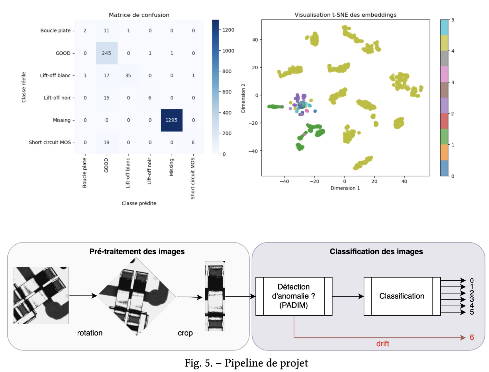
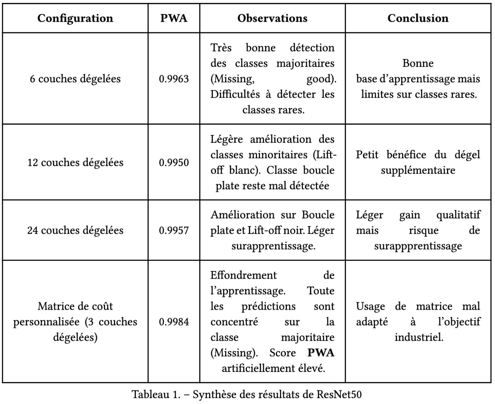

# Valeo Data Challenge – Industrial Quality Control with Computer Vision

## 📌 Context
This project was carried out as part of the **Valeo Data Challenge (2025)**, aiming to improve **industrial quality control** using computer vision.  
The goal was to automatically detect defective components from camera images to reduce human workload and increase robustness of production lines.

- Dataset: ~9,000 images  
  - **1 “GOOD” class**  
  - **6 defect classes** (Missing, Lift-off black/white, Short circuit MOS, Flat loop, Drift anomalies)  
- Evaluation metric: **Penalty Weighted Accuracy (PWA)**, a custom cost-sensitive metric penalizing missed defect detections more heavily than false alarms.  

---

## 🛠️ Methodology
1. **Preprocessing**: image rotation & cropping (benchmark aligned).  
2. **Anomaly detection (PADIM)**: pre-filtering out-of-distribution “drift” anomalies.  
3. **CNN architectures**:
   - Basic CNN → PWA = **0.956**  
   - Deeper CNN (5 conv blocks) → PWA = **0.994**  
4. **Transfer learning**:
   - ResNet-50 (ImageNet pre-trained, partial fine-tuning) → PWA up to **0.996**  
   - ResNet-101 deeper variant → best compromise with 12 unfrozen layers + dropout 0.3 → PWA = **0.994**  
5. **Custom cost matrix**: boosted PWA (0.998) but caused model collapse (predicting only majority class) → revealed a **bias in the metric**.

---

## 📊 Key Results
- **Deeper CNNs** improved recognition of minority defect classes.  
- **ResNet-50 fine-tuned**: strong baseline but still struggles on rare classes.  
- **ResNet-101 moderate fine-tuning**: best balance, avoids overfitting.  
- ⚠️ The **custom PWA metric can be gamed**, suggesting better evaluation criteria are needed in real industrial contexts.  

---

## 🚀 Tech Stack
- Python, TensorFlow/Keras  
- PADIM anomaly detection  
- ResNet architectures (transfer learning, ImageNet)  
- Visualization: t-SNE, confusion matrices  

---

## 📷 Visuals

