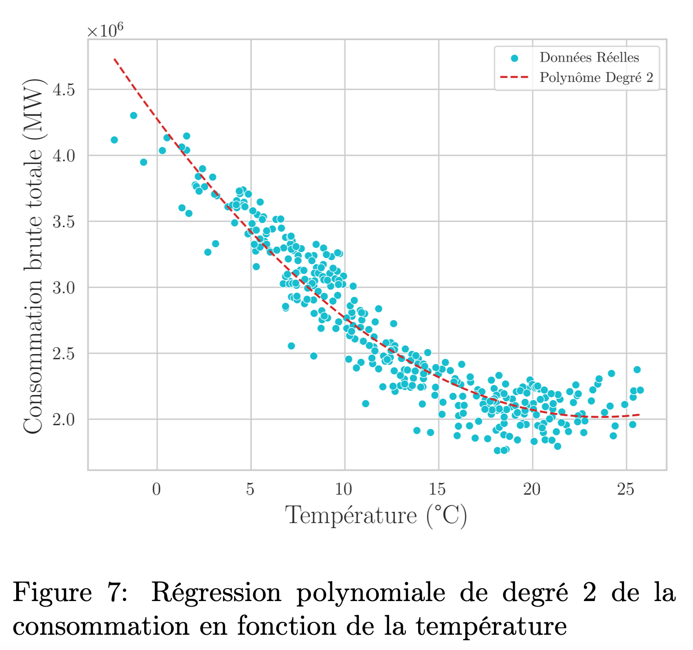
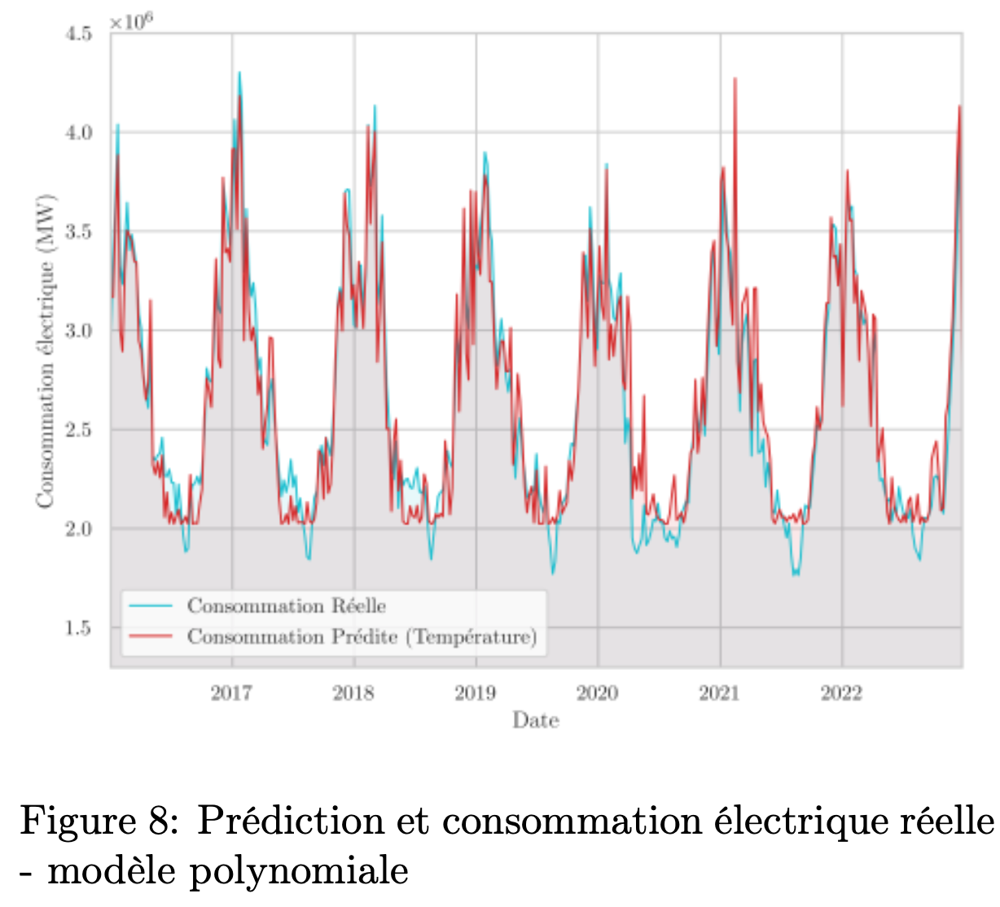
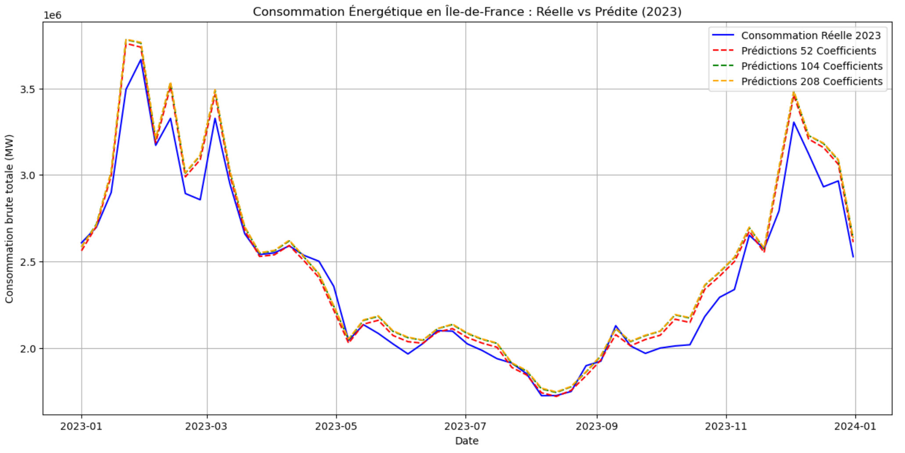

# Electricity Consumption Forecasting

This project focuses on forecasting electricity consumption in the Île-de-France region using open data from RTE (electricity consumption) and data.gouv (temperature).  
The goal is to model the relationship between temperature, time, and electricity demand in order to anticipate consumption trends and improve energy management.  

---

## 📌 Context

Forecasting energy demand is essential for ensuring grid stability, economic efficiency, and sustainability.  
We study the link between electricity consumption and temperature, with an emphasis on capturing periodicity and seasonal effects.

- **Data**: Electricity consumption (2016–2024), regional temperature (2016–2022).  
- **Initial hypothesis**: Consumption is mainly driven by temperature.  
- **Challenge**: Add temporal components to improve robustness of predictions.  

---

## 🔎 Methodology

1. **Correlation analysis**  
   - Pearson correlation coefficient: **-0.91** → strong negative correlation.  
   - Visualization confirms consumption increases when temperature decreases.  

2. **Linear regression**  
   - Simple model: consumption = a·T + b.  
   - MAPE ≈ **7.8%**, MSPE ≈ **1.0%**.  
   - Works well but fails on extreme values.  

3. **Polynomial regression (degree 2)**  
   - Captures U-shaped relationship around 20°C.  
   - MAPE ≈ **5.2%**, better fit than linear model.  

4. **Temporal modeling (periodicity)**  
   - Added **Fourier terms** (seasonal effects) and **cubic splines** (flexible trends).  
   - Integrated into a **Generalized Additive Model (GAM)**.  
   - Robustness checked with **K-Fold cross-validation (K=5)**.  
   - Best model with **208 coefficients** → MAPE ≈ **3.2%** forecasting, stable predictions.
  
<p align="center">
  
  
  
</p>


---

## 📊 Key Results

- Strong inverse correlation between temperature and electricity demand.  
- Polynomial and GAM-based models improve prediction accuracy.  
- Predictions for 2023 closely match real consumption values.  
- Temporal features (Fourier + splines) significantly reduce residual errors.  

---

## 🗂 Repository Structure

```plaintext
/ElectricityConsumptionForecast
 ├── notebook/   # Jupyter notebook with data analysis, preprocessing and modeling
 ├── report/     # PDF report with methodology, results and conclusions
 ├── data/       # Open data CSV files (electricity consumption, temperature)
 ├── images/     # Figures for README (plots, correlations, predictions)
 └── README.md   # Project description
```
