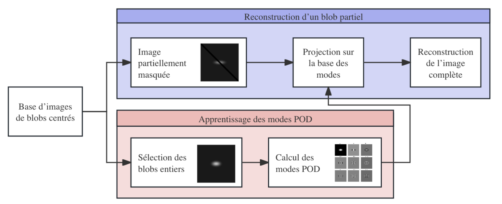
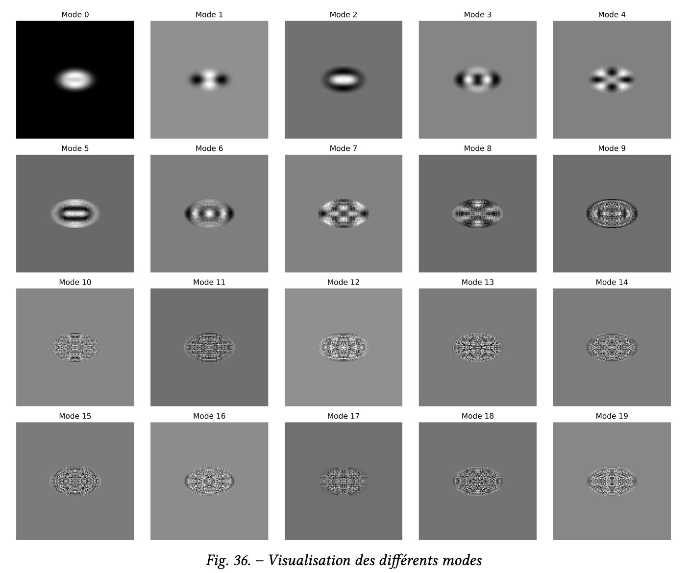
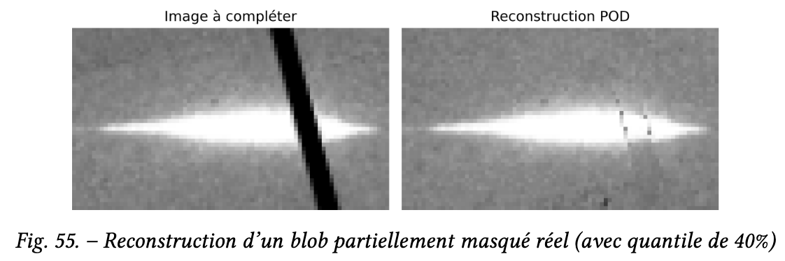
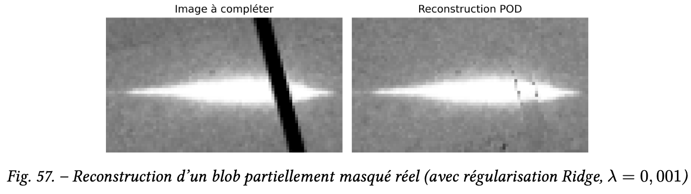

# Blob Detection and Reconstruction in X-ray Diffraction Images

**Research project in collaboration with CEA-DAM**  
*(TER – ENS Paris-Saclay, 2025)*

---

## 🎯 Context

In high-pressure physics experiments using diamond anvil cells (DAC), X-ray diffraction produces 2D images containing **diffraction spots (“blobs”)**.  
These blobs encode critical information about the **crystal structure, orientation, and phase transitions** of materials under extreme conditions (pressures > 100 GPa).

However, experimental images often suffer from:
- **Noise and artifacts** (mechanical masks, parasitic diffraction, detector issues),
- **Blob overlap** or partial masking,
- **Intensity loss** at the image periphery (Beer–Lambert law).

👉 Automatic blob detection and reconstruction is thus essential for reliable material characterization.

---

## 🧩 Objectives

1. **Blob segmentation**: Identify blobs in noisy diffraction images.  
2. **Blob reconstruction**: Reconstruct partially masked blobs to recover shape, intensity, and position.  
3. **Validation**: Assess robustness of algorithms on both synthetic and real experimental data.

---

## 🔬 Methodology

### 1. Segmentation
- **Differential methods** (Laplacian of Gaussian, gradient-based)
- **Watershed segmentation (LPE)**:
  - Gradient computation
  - Local minima detection
  - Region growing until flooding frontiers meet

---

### 2. Reconstruction by Proper Orthogonal Decomposition (POD / PCA)
- Build a **modal basis** from a dataset of complete blobs
- Represent each blob as a linear combination of dominant modes
- Solve a **least-squares problem** restricted to observed pixels
- Add **Ridge regularization** for stability under noise

Pipeline:
<p align="center">
  
</p>


---

### 3. Experimental Validation
- Extract training blobs from real diffraction images  
- Reconstruct masked blobs using POD projection  
- Evaluate quality with **MSE, PSNR, SSIM**  
<p align="center">
  
  
  
</p>

---

## 📊 Results

- **Synthetic blobs**: POD achieves near-perfect reconstruction for centered blobs (PSNR > 65 dB, SSIM ≈ 1.0).  
- **Decentered blobs**: performance drops → iterative recentering by center of mass proposed.  
- **Real data**:
  - POD reconstructs partially masked blobs with reasonable fidelity.
  - Adaptive masking (quantiles) improves boundary realism.
  - Regularization helps reduce overfitting to noise.

---

## ⚙️ Tech Stack

- **Languages**: Python (NumPy, SciPy, scikit-image, Matplotlib)  
- **Algorithms**: Watershed, Laplacian of Gaussian, PCA/SVD, Ridge regression  
- **Validation metrics**: MSE, PSNR, SSIM  

---

## 📎 Repository Structure
```
/Project2_ComputerVision
 ├── POD/               # Proper Orthogonal Decomposition (POD / PCA)
 ├── data_genaration/   # Image generation / processing
 ├── report/            # PDF report
 ├── images/            # key figures for README
 └── README.md
```

 ## 📄 References
[1]  Robin Fréville. Transitions de phase et microstructures induites dans les métaux en conditions extrêmes : fer et étain. Science des matériaux [cond-mat.mtrl-sci]. Université Paris-Saclay, 2023. Français. ⟨NNT : 2023UPASP133⟩. ⟨tel-04499904⟩

[2] Cours Master 2 ATSI, Méthodes par patchs pour la photographie computationelle :Image and video inpainting, Yann Gousseau. 

[3] A Qualitative Report on Diffusion based Image Inpainting Models, Gamini Sridevi and Srinivas Kumar

[4] Image Inpainting, Bertalmio et al.

[5] PatchMatch: A Randomized Correspondence Algorithm for Structural Image Editing, Barnes et al.

[6] A Generalized Laplacian of Gaussian Filter for Blob Detection and Its Applications, Hui Kong, Hatice Cinar Akakin, and Sanjay E. Sarma

[7] A fast methodology to determine the characteristics of thousands of grains using three-dimensional X-ray diffraction. I. Overlapping diffraction peaks and parameters of the experimental setup, Hemant Sharma, Richard M. Huizenga and S. Erik Offerman
